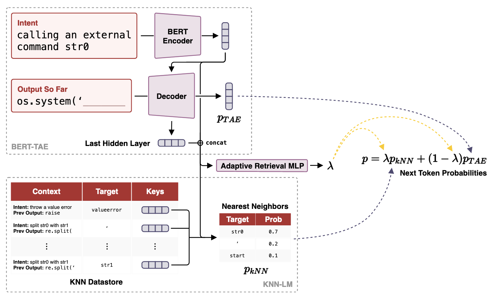

_Advised by Frank Xu_

Transformer-based models have achieved state-of-the-art results on the task of code generation from natural language. Nevertheless, these generation methods have difficulty memorizing rare patterns in the dataset, which often leads to sub-optimal performance. We present CodeKs,[^codex] a novel framework for code generation that alleviates this problem using non-parametric methods. Our framework consists of two modules: (1) a transformer-based code generation module for predicting future token probabilities and embedding vectors that can be used for non-parametric retrieval; (2) a non-parametric retrieval module based on $k$NN-LM which uses the embedding vectors of the generation module as context to search for top $k$ tokens at the next timestamp. Our method outperforms the state-of-the-art model on CoNaLa dataset using BLEU metric, proving that non-parametric methods, which store context-token relationships explicitly, have benefits over parametric methods for the code generation task.

    
Full PDF

    
Code

[^codex]: No relation to OpenAI's Codex :)