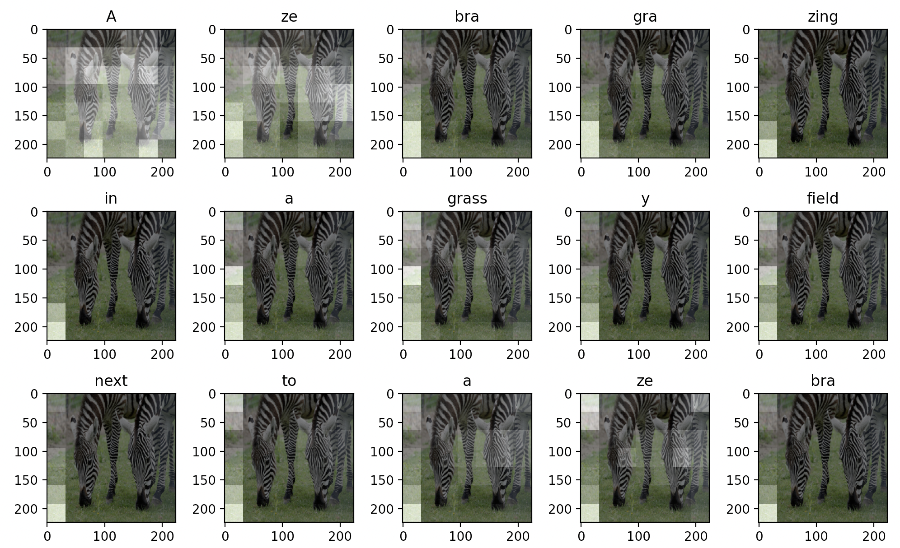

Inspired by recent advances in image captioning as well as in language modeling and language generation, we evaluate a variety of decoder architectures on the COCO Captions 2014 dataset, including Markov chains, recurrent neural networks, attention mechanisms, and transformers. Our proposed transformer models improve upon the baseline models by +4 BLEU-4 score and create feasible captions that approach those created by humans.

    
Full PDF

    
Code

