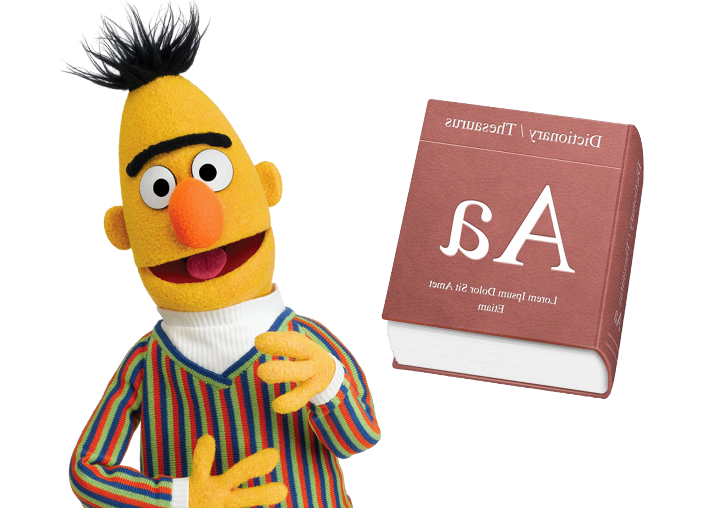

_Advised by Professor Kemal Oflazer_

The reverse dictionary task is that of predicting a word given its definition or natural language description. Reverse dictionaries have a number of applications, from aiding in second language acquisition to helping writers better express their ideas. In this project, we replicate the current state-of-the-art BERT-based reverse dictionary models, extending them using variants of BERT and employing a variety of different training objectives. We employ models based on the SentenceBERT and CharacterBERT variants of BERT, and we introduce a novel BERT-based model utilizing multilabel classification that outperforms existing BERT baselines on unseen data.

    
Full PDF

    
Code

