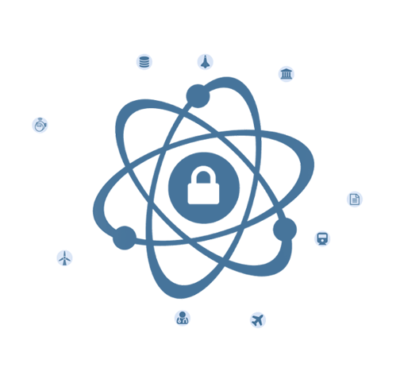
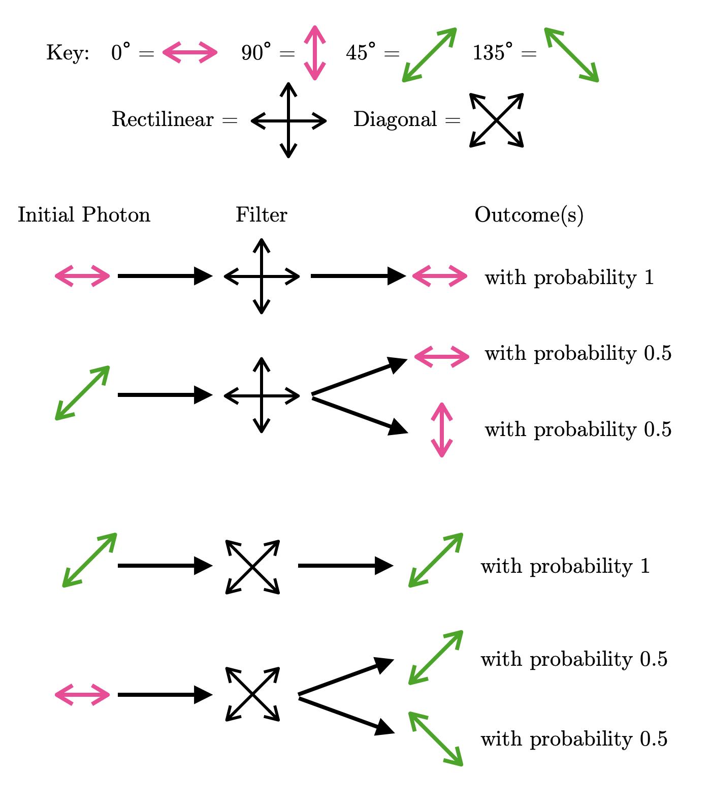
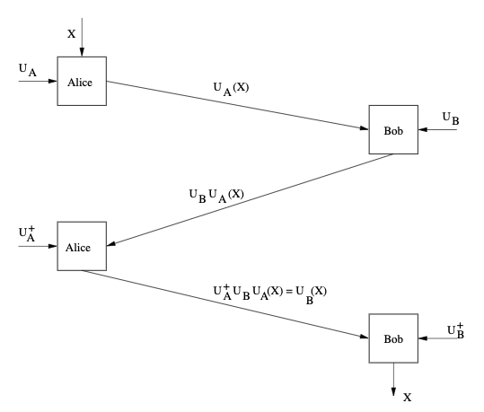

## Table of Contents
1. [Introduction](#intro)
2. [Quantum Physics Primer](#primer)
    1. [Photon Polarization](#polar)
    1. [Measuring Photons](#photons)
    1. [The Uncertainty Principle](#uncertainty)
3. [Quantum Key Distribution and Quantum Encryption](#qkd)
    1. [BB84](#bb84)
        1. [Analysis of Security](#bb84sec)
    1. [B92](#b92)
    1. [Kak's Three-Stage Protocol](#kak)
        1. [Analysis of Security](#kaksec)
4. [Qiskit Demo of QKD Protocols](#demo)

## 1. Introduction 

Most modern cryptographic protocols rely on the computational hardness of certain problems. Diffie-Hellman key exchange, for example, depends on the hardness of the discrete log problem, while RSA depends on the difficulty of the integer factorization problem. While these assumptions have held so far, with quantum computers on the horizon, they may not hold for much longer. As such, it is of the utmost importance that we find new protocols that rest their security on more solid foundations. In this article, we introduce a set of quantum cryptography protocols that derive their security not from any assumptions of computational hardness, but from quantum mechanics itself. 

## 2. Quantum Physics Primer 

We first cover (non-rigorously) some of the fundamental quantum properties involved in quantum cryptography.

### 2.1 Photon Polarization 

If you've ever worn sunglasses or watched a 3D movie, then you've seen polarization firsthand. In classical physics, the polarization of a wave is the direction in which it oscillates (this direction is perpendicular to the direction of the wave's motion). Further, a waveform with multiple polarizations can be _polarized_, that is, made to have a single polarization, by a filter, which operates by absorbing the components perpendicular to its orientation and passing the components parallel to it. As light is considered a wave in classical physics, it has a polarization, and unpolarized light can be polarized -- for example, sunlight is polarized by the lenses of sunglasses.

In the quantum realm, polarization of light waves has an analogue in photon polarization. The polarization of a photon is a quantum system with a qubit degree of freedom, and hence we can represent it much like how we represent electron spin. Recall that we express the spin of an electron as a superposition of $\ket{0}$ and $\ket{1}$, the \"spin up\" and \"spin down\" basis states. Similarly, we can express the polarization of a photon as a superposition of $\ket{0}$ and $\ket{1}$, where we redefine $\ket{0}$ and $\ket{1}$ to represent the horizontal and vertical photon polarization states.

<b>Theorem:</b> Let the state vector $\ket{\phi}$ represent the polarization of a photon. Then for some complex $\alpha_0, \alpha_1$,
$$
    \ket{\phi} = \alpha_0\ket{0} + \alpha_1\ket{1}
$$
where $\alpha_0^2 + \alpha_1^2 = 1$.

More generally, we can represent photon polarization as a superposition of any pair of orthogonal basis states (including but not limited to $\ket{0}$ and $\ket{1}$. For our quantum cryptography applications, we will consider two such pairs: the rectilinear basis and the diagonal basis.

The rectilinear basis consists of the horizontally (0&deg;) and vertically (90&deg;) polarized states, denoted $\ket{H}$ and $\ket{V}$ respectively, where

$$\ket{H} = \ket{0} = 
    \begin{pmatrix}
        1 \\
        0
    \end{pmatrix}
$$
$$\ket{V} = \ket{1} = 
    \begin{pmatrix}
        0 \\
        1
    \end{pmatrix}
$$

Meanwhile, the diagonal basis consists of the diagonally (45&deg;) and anti-diagonally (135&deg;) polarized states, $\ket{D}$ and $\ket{A}$, where

$$\ket{D} = \frac{1}{\sqrt{2}}\ket{0} + \frac{1}{\sqrt{2}}\ket{1} =
        \begin{pmatrix}
            \frac{1}{\sqrt{2}} \\
            \frac{1}{\sqrt{2}}
        \end{pmatrix}
$$
$$\ket{A} = \frac{1}{\sqrt{2}}\ket{0} - \frac{1}{\sqrt{2}}\ket{1} =
        \begin{pmatrix}
            \frac{1}{\sqrt{2}} \\
            -\frac{1}{\sqrt{2}}
        \end{pmatrix}
$$

As a sidenote, generally, we can express the state of a photon polarized at an angle of $\theta$ degrees from the positive x-axis as 

$$\cos(\theta)\ket{0} + \sin(\theta)\ket{1} = \begin{pmatrix}
    \cos(\theta) \\
    \sin(\theta)
\end{pmatrix}$$

### 2.2 Measuring Photons 

It is important to note that by the uncertainty principle (discussed in the next section) it is impossible to directly measure the polarization of a photon. That is, given some photon with polarization state $\ket{\psi} = \cos(\theta) \cdot \ket{0} + \sin(\theta) \cdot \ket{1}$, we cannot physically determine $\theta$.

However, what we can measure is a photon's polarization through a filter. Like a classical filter for a light wave, a photon filter passes a photon polarized parallel to its orientation and absorbs a photon polarized perpendicular to it. Alternatively, a polarizing beam splitting filter can be made to send parallel photons in one direction and perpendicular photons in another, thus distinguishing between the two. Note that from this point onward, we will assume all our filters behave like this.

Interestingly however, a photon that is not initially parallel or perpendicular to a filter's orientation will be probabilistically projected into one of those two directions. Thus, a photon always emerges from a filter with polarization parallel or perpendicular to the filter's orientation.

<b>Theorem:</b> If a photon polarized at an angle of $\alpha$ is sent into a filter oriented at an angle of $\beta$, it will have probability $\cos^2(\alpha - \beta)$ of becoming polarized parallel to the filter and complementary probability $\sin^2(\alpha - \beta)$ of becoming polarized perpendicular to the filter.

For our purposes, we will consider two orientations of filters which correspond to the two bases we discussed in the previous section, rectilinear and diagonal. As you might expect, the rectilinear filter is oriented at an angle of 0&deg;, while the diagonal filter is oriented at an angle of 45&deg;.

Observe that if we send a photon polarized 0&deg; or 90&deg; (i.e. one of the rectilinear basis states) into a rectilinear filter, the photon emerges unchanged with probability 1, so the outcome is deterministic. Likewise, if we send a photon whose polarization is one of the diagonal basis states into a diagonal filter, the photon's polarization does not change. However, if we send a photon polarized 45&deg; (or 135&deg;) into a rectilinear filter, then by the above theorem, there is a 50-50 chance of observing a 0&deg; or 90&deg; polarized photon. The same holds for diagonal filters and the rectilinear polarization states.

    
    
<b>Figure 1:</b> Behavior of rectilinear and diagonal filters

### 2.3 The Uncertainty Principle 

At the core of quantum cryptography and its guarantees of security is the uncertainty principle. In layman's terms, it is as follows:

<b>Theorem:</b> In a quantum system, only one property of a pair of conjugate properties can be known with certainty.<a id='ref:unc' href='#fn:unc'>$^1$</a>

For brevity, we won't go into the meaning of _conjugate_ properties -- what is important is that photon polarization is one such property. Hence, we can make the following statement:

<b>Corollary:</b> It is not possible to determine simultaneously a photon's rectilinear and diagonal polarizations.

Note that this fact is illustrated by the results of the previous section. We might try, for instance, to determine both polarizations of a photon by passing it through a rectilinear filter followed by a diagonal filter. However, measuring a photon with a rectilinear filter yields a photon whose polarization is one of the rectilinear basis states, destroying all information about the original polarization of the photon (unless the original photon's polarization was one of the rectilinear basis states). Thus, the diagonal filter will give us no meaningful information about the original photon's diagonal polarization.

An alternative strategy might be to take the photon and \"copy-paste\" its polarization state onto other photons, then perform measurements on these photons. This, however, is banned by the no-cloning theorem, which follows from the uncertainty principle. It is as follows:

<b>Theorem:</b> It is not possible to create identical copies of an arbitrary quantum state.<a id='ref:unc' href="#fn:unc">$^1$</a>

    <a href='#ref:unc'>$^1$</a> Taken from 
        <a href='https://www.cse.wustl.edu/~jain/cse571-07/ftp/quantum/'>
        https://www.cse.wustl.edu/~jain/cse571-07/ftp/quantum/</a>

## 3. Quantum Key Distribution and Quantum Encryption 

Now that we have discussed some of the interesting properties of quantum systems and photons in particular, we will see how we can leverage them to perform key distribution.

### 3.1 BB84 

Let's say Annie and Britta want talk privately, but their computationally-unbounded frenemy Pierce is listening in on the conversation. To accomplish this, they decide to use one-time pad. However, they run into the issue of exchanging a secret key -- with his computational power, Pierce can break Diffie-Helman! Fortunately, they have an alternative in the BB84 quantum key distribution protocol

The BB84 protocol requires two public channels: a quantum channel over which Annie can send Britta random bits encoded as photons, and an authenticated conventional (i.e. non-quantum) channel over which Annie and Britta can later verify their results.

| Bit | Polarization Options |
|:---:|:-:|
| 0 | 0&deg; or 45&deg; |
| 1 | 90&deg; or 135&deg; |
|---|-|

<b>Table 1:</b> BB84 Encoding Scheme

First, Annie generates $4n$ random bits, $n$ of which we expect will make it into the shared key, as we will soon see. Then, for each bit, she generates a polarized photon according to Table 1 (which is public knowledge), picking between the two polarization options at random, and sends the photon to Britta. Since Annie is the only one that knows the actual polarization of the photon, Britta simply picks independently and randomly between the rectilinear and diagonal filters to measure the photon. Britta records the result of the measurement (which corresponds to a bit, 0 or 1) as well as the filter used. 

After all photons have been received and measured by Britta, Annie announces in the conventional channel the basis each photon actually lies in. Observe that this gives no information about the bit itself: if Annie declares that a photon was diagonal, then its polarization could be either 45&deg; or 135&deg;, which corresponds to either a 0 or a 1; if Annie declares that it was rectilinear, its polarization could be either 0&deg; or 90&deg;. 

In response, Britta tells Annie via the conventional channel which photons she measured with the correct filter (note that she does not say what values/bits she actually measured). The bits corresponding to these photons must be shared between the two and are kept, while the remaining bits are random garbage produced from measuring with the wrong basis and are thrown away. It is not difficult to see that (assuming no errors in her measuring device) Britta can expect to get half of her filter choices correct and thus can expect to accurately receive $2n$ bits from Annie.

Finally, Britta randomly chooses half of her bits to sacrifice and publishes them in the conventional channel. Annie compares these bits to her own. If the number of discrepancies is above a certain threshold, the two parties abort. Otherwise, the process is complete, and the remaining $n$ bits make up Annie and Britta's shared secret key.

#### 3.1.1 Analysis of Security 

To this point, we have ignored the presence of Pierce, who is attempting to steal their secret key and avoid being detected in the process. We will assume for simplicity that Pierce can only observe what is sent in the conventional channel, but he can interfere with the quantum channel.

Suppose Pierce's strategy is to intercept each photon from Annie, measure it with one of the two filters, then transmit the output of the filter to Britta. For any given photon, Pierce has a $\frac{1}{2}$ chance of picking the correct filter. If he does pick the correct filter, the photon will be passed onto Britta without modification, and he will avoid detection for that bit. However, if he picks the wrong filter, the photon will come out in the other basis. Thus, when Britta passes it through her filter (assuming she picks the right filter for the _original_ photon), she will get a random result, with $\frac{1}{2}$ chance of getting the same bit as Annie and $\frac{1}{2}$ chance of getting a different bit. Hence, the probability that any given measurement by Pierce does not alter the bit measured by Britta (given that Britta measures with the correct filter) is $\frac{3}{4}$.

Thus, when Annie and Britta publicly compare $n$ bits at the end of the protocol, the probability that all the bits match up is $(\frac{3}{4})^n$, which is exponentially small. Even if the two parties allow a certain margin of error, as $n$ grows large, the probability that Pierce continues to evade detection grows arbitrarily small. 

### 3.2 B92 

B92 is a simplified version of BB84 that is much easier to implement in practice. The main difference is that Annie now uses only two distinct polarization states, 0&deg; for 0 bits and 45&deg; for 1 bits.

As before, Britta randomly picks a basis to measure the photon in. However, since there are only two states, Britta can make certain conclusions based on what she measures. 

Suppose Britta picks the rectilinear filter and measures a 90&deg; photon. Then she can be sure that Annie sent a 45&deg; photon. This is because the only other option, a 0&deg; photon, would have emerged from the filter still with 0&deg; polarization with probability 1 (see Section 2.2, in particular Figure 1). Similarly, if Britta picks the diagonal filter and measures a 135&deg; photon, she can safely assume that Annie sent a 90&deg; photon. Note however, that if Britta uses a rectilinear filter and observes a 0&deg; photon, she cannot know the original polarization of the photon. The same goes if Britta uses a diagonal filter and observes a 45&deg; photon. These results are summarized below. 

| Observed Polarization | Original Polarization | Bit |
|:---------------------:|:---------------------:|:---:|
| 90&deg; | 45&deg; | 1 |
| 135&deg; | 0&deg; | 0 |
| 0&deg; | unknown | unknown |
| 45&deg; | unknown | unknown |
|-------------|-----|-----|

<b>Table 2:</b> What the receiver learns from their observations

Due to this ability to determine bits solely based on observed polarizations, there is no longer a need for the two parties to exchange their lists of bases/filters used. Hence, after the photons have all been sent, they can proceed to the final step of comparing random bits and determining the error rate. 

It is important to note though, that if Annie sends a 45&deg; photon, there is only a $\frac{1}{2}$ probability that Britta measures a 90&deg; photon. The other half of the time, Britta measures a 0&deg; photon and is unable to conclude the polarization of the photon. Thus, it turns out B92 is only half as efficient as B84 -- this is the price we must pay for the simplicity of the protocol.

### 3.3 Kak's Three-Stage Protocol 

Like the above two protocols, Kak's protocol cleverly uses the uncertainty principle to facilitate secret communication. However, unlike the previous two, which were concerned solely with distributing a secret key, Kak's protocol allows the two parties to transmit arbitrary data. 

At the start of the protocol, both parties separately generate their own secret key. This secret key takes the form of a photon rotation operator. Essentially, this is a system that takes in a photon and rotates its polarization by some fixed amount. Let $R(\theta)$ denote a rotation operator that rotates a photon by angle $\theta$. Mathematically, we can define $R(\theta)$ as the following:

$$R(\theta) = \begin{pmatrix}
        \cos(\theta) & -\sin(\theta) \\
        \sin(\theta) & \cos(\theta)
    \end{pmatrix}
$$

We can verify that a photon polarized at an angle of $\phi$ is indeed rotated by an angle of $\theta$ after being multiplied by $R(\theta)$:

$$\scriptsize{\begin{pmatrix}
        \cos(\theta) & -\sin(\theta) \\
        \sin(\theta) & \cos(\theta)
    \end{pmatrix}\begin{pmatrix}
        \cos(\phi) \\
        \sin(\phi)
    \end{pmatrix} = \begin{pmatrix}
        \cos(\theta)\cos(\phi) - \sin(\theta)\sin(\phi) \\
        \sin(\theta)\cos(\phi) + \cos(\theta)\sin(\phi)
    \end{pmatrix} = \begin{pmatrix}
        \cos(\theta + \phi) \\
        \sin(\theta + \phi)
    \end{pmatrix}}
$$

Hence, at the start of the protocol, Alice picks some angle $\alpha$ and Bob picks some angle $\beta$, making their secret keys $U_A = R(\alpha)$ and $U_B = R(\beta)$, respectively. 

Also at the start, both parties publicly agree on an orthogonal basis (i.e. rectilinear) and agree to let one of the basis states represent a 0 bit and the other a 1 bit (i.e. they might decide $\ket{H}$ corresponds to 0 and $\ket{V}$ corresponds to 1). 

With these initial preparations completed, the protocol can begin in earnest. In the first stage, Alice encodes the (classical) bit she wants to send as a photon whose polarization state $X$ is the basis state previously agreed upon. She applies her secret key $U_A$ on $X$, altering the polarization state of the photon to $U_{A}X$, then sends the photon over to Bob.

In the second stage, Bob applies his rotation operator $U_B$ on the photon from Alice, changing the polarization to $U_{B}U_{A}X$, then sends the photon back to Alice.

In the third and final stage, Alice applies $U_{A}^+ = R(-\alpha)$, the inverse of $U_A$ (i.e. $U_A^{+}U_A = U_AU_{A}^+ = I$) on the photon. Since the rotation operators are commutative (i.e. rotating by $\alpha$ then $\beta$ must be equivalent to rotating by $\beta$ then $\alpha$), the polarization of the photon becomes:
\\[
U_{A}^{+}U_{B}U_{A}X = U_{A}^{+}U_{A}U_{B}X = U_{B}X.
\\]
This photon is sent back to Bob, who applies $U_{B}^{+} =  R(-\beta)$ on the photon, yielding $U_{B}^{+}U_{B}X = X$. Bob can now pass this photon through a rectilinear filter to determine its polarization and thus obtain the bit Alice encoded.

The three stages of Kak's protocol. Figure reproduced from <i>A Three-Stage Quantum Cryptography Protocol</i> by Subhash Kak (2018)

#### 3.3.1 Analysis of Security 

It turns out that Kak's protocol provides (near) perfect security! Recall that it is not possible to directly measure the polarization of a photon. Thus, if at any stage of the protocol an adversary intercepts the photon, they can extract no meaningful information out of it.

## 4. Qiskit Demo of QKD Protocols 

Linked below is an implementation of B92 and Kak's protocol using the [IBM Qiskit](https://qiskit.org/) simulation framework.

    
Code Demo

